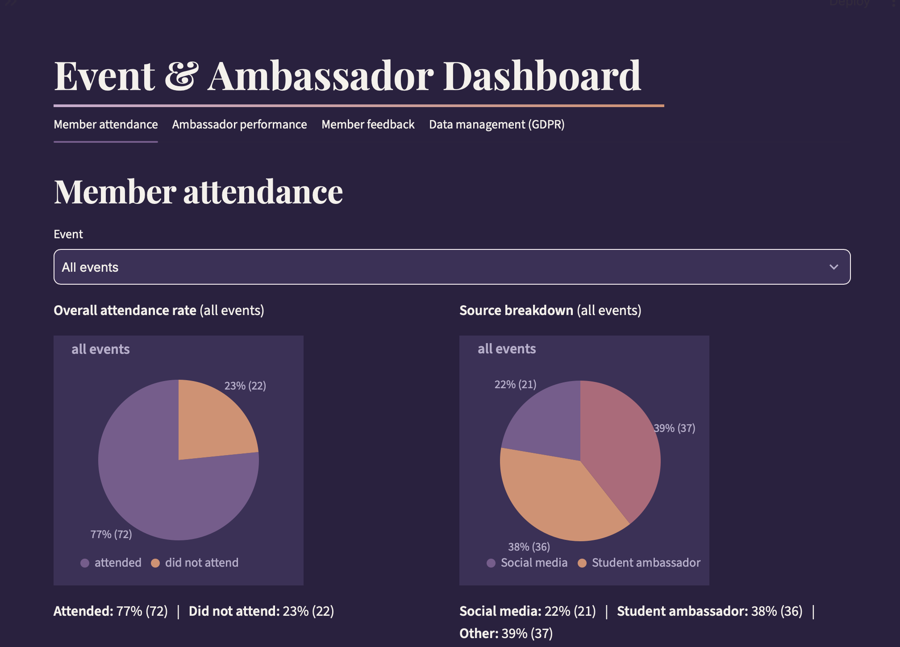
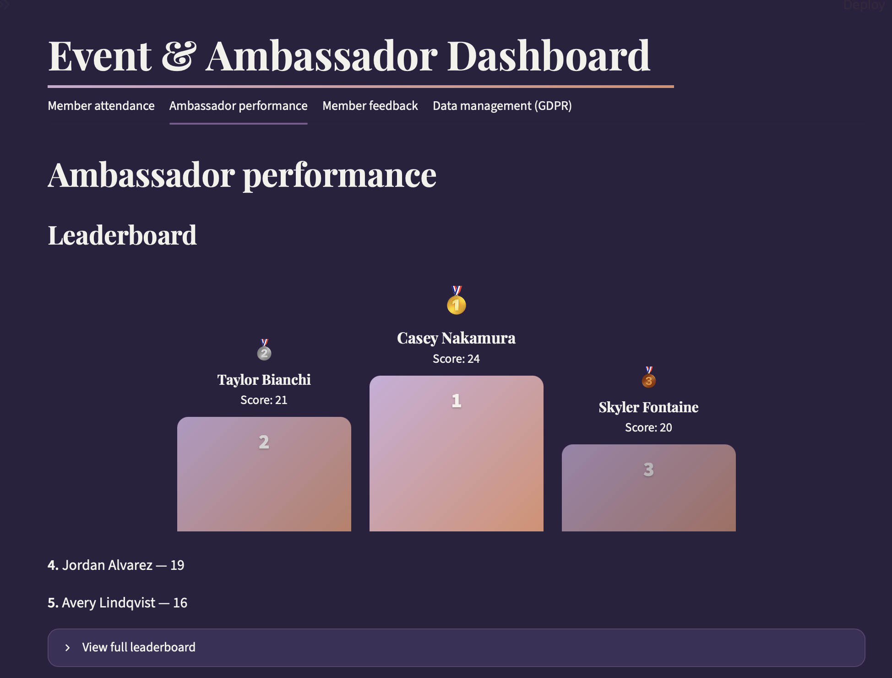

# Event & Ambassador Dashboard




A Streamlit dashboard for tracking event attendance and student ambassador
performance, built with SQLite and pandas.

## Features

- **Member attendance** — opens with two stacked rows of pie-chart pairs.
  "All events" on top (attendance rate + source breakdown, aggregated
  across every event, constant regardless of any selection); "By event"
  below it, with its own dropdown (defaulting to the most recent event by
  date) driving its own attendance-rate + source-breakdown pair — changing
  that dropdown only updates the "By event" row. Every slice is labeled
  with percentage + raw count. Below that, a collapsible "Members list"
  expander (collapsed
  by default) holds student/non-student and alumnus filters, a "Filter by
  event attended" dropdown (defaults to "All events"; picking one narrows
  the list to members with an `attended` record for it), and a free-text
  search matching name, email, *or* any event the member has attended
  (e.g. searching an event name surfaces everyone who attended it) —
  partial, case-insensitive, and all filters combine together (AND logic).
  Further down, import Luma-style CSV exports with a column-mapping UI, or
  add/edit members and attendance manually. An optional "sync" toggle
  flags any member in the system (however they were added) whose email is
  missing from the uploaded file for removal; a safety threshold blocks the
  sync outright if it would remove more than 50% of members, and otherwise
  shows a preview with a dedicated, separate confirmation step before any
  removal is applied (via the same anonymize function as the GDPR tab).
  Fields are type-specific: students get `year_of_study`/`degree` (no
  `job_role`/`company`, and `is_alumnus` is forced off since a current
  student can't be an alumnus); non-students get `job_role`/`company` and a
  normal alumnus toggle. This applies consistently in the manual form (the
  fields shown update live as you change the member-type radio) and in CSV
  import, where type is inferred per row from whichever fields are mapped
  and filled — switching an existing member from non-student to student
  (manually, or via a re-import) always resets `is_alumnus` to false.
- **Ambassador performance** — manage the ambassador roster, log social media
  posts, and see a leaderboard ranked by a composite score:
  `(successful_referrals x 3) + (social_posts_count x 1) + (own_events_attended_count x 1)`,
  with a plain-language explanation of that formula shown as a muted
  caption directly under the "Leaderboard" heading. The top 3 are shown as
  a podium (1st centered and tallest, degrading
  gracefully with 1-2 ambassadors), 4th/5th as a plain text list, and a
  "View full leaderboard" expander below always holds the complete table
  (1st place onward) with the full score breakdown — plus a per-ambassador
  drill-down.
- **Member feedback** — anonymized overview (no names or member IDs shown),
  rating trend over time, per-event breakdown, and flags for notably
  low-rated events/periods.
- **Data management (GDPR)** — search for a member and erase them: their
  attendance, feedback, and social-post records are anonymized (member/
  ambassador ID set to NULL) rather than deleted, so aggregate stats stay
  accurate, and their identity row is removed. Every erasure shows a
  confirmation dialog listing exactly what will change, and is logged to
  `deletion_log` with a timestamp and a generic description only.

## Stack

Python, Streamlit, SQLite, pandas, Altair (for the attendance pie chart — bundled with Streamlit, listed explicitly since it's imported directly).

## Visual design

A warm, human theme inspired by KCL Womxn in STEM's brand: violet
(`#7A5C8E`) and coral (`#D98F6E`) accents with a dusty-pink highlight
(`#E8B4B8`, same in both modes for brand consistency), Playfair Display
serif headings paired with Inter for body text/data, ~12px rounded corners
on cards/buttons/inputs, and a violet-to-coral gradient used sparingly
(primary buttons, title underline, the active item in the sidebar nav). A
**"Dark mode" toggle** in the sidebar (visible on every section, on by
default) switches between two purple-toned palettes: light mode is
`#834D88` background, `#5B3560` cards/inputs (kept darker than the
background for clear separation, since `#834D88` is already fairly
light/saturated to begin with), off-white `#F5F1EB` text, `#E3D9EF` muted
text, `#CDB0D1` borders, and its own lightened status colors; dark mode is
the original deeper `#2A2140` background, `#3D3159` cards/inputs, the same
off-white text, `#B8AECC` muted text, `#55486E` borders, and its own
(less-lightened) status colors — each palette's secondary colors were
tuned against its own background rather than shared, since one is much
brighter than the other. Stored in `st.session_state["dark_mode"]` and
re-rendered immediately on toggle, no reload needed. Base colors live in
[.streamlit/config.toml](.streamlit/config.toml) (static fallback); the
mode-aware palette, fonts, radii, and gradient accents are generated by
[style.py](style.py)'s `get_css()` and re-injected on every rerun from
[app.py](app.py). Pie/line charts (Altair/Vega-Lite) render with a
transparent background so they blend into the page in either mode; their
text and gridlines follow the toggle too. `st.dataframe` tables are a
deliberate, verified exception: they paint their grid to an HTML5 canvas
(glide-data-grid) whose header/cell colors are pixel-rendered once from
the static server-side theme in `.streamlit/config.toml` — confirmed (via
pixel sampling and DOM inspection, not assumption) that neither injected
CSS nor Streamlit's own `embed_options=dark_theme` mechanism can change
already-painted canvas pixels, so table cells stay dark-on-white
regardless of mode (still fully readable on their own terms, just not
chromatically tinted). Everything CSS *can* reach around them — container
border-radius, border color, a coral hover glow, and the toolbar's
sort/search/download icons — is centralized in one shared block in
[style.py](style.py) so every table in the app (and any future one) picks
it up automatically with no per-table styling needed.

### Navigation

Both the native top tabs and the sidebar list navigate, and stay in sync.
`st.tabs()` is the single source of truth for which section is showing —
all four are rendered every run and clicking a tab label works exactly as
plain `st.tabs()` always does, natively, client-side, no Python round
trip. The sidebar doesn't render its own content or track its own
"current section" in `st.session_state`; a sidebar button click instead
asks a small script (injected via `st.components.v1.html`, see the bottom
of [app.py](app.py)) to click the matching native tab on Streamlit's
behalf, and that same script keeps the sidebar's highlight in sync with
whichever tab is actually selected via a `MutationObserver` watching the
tab list — so a direct tab click updates the sidebar too, with no
Python-side state for "active section" at all. One non-obvious fix
learned while building this: `st.components.v1.html` recreates its iframe
(and therefore kills any `MutationObserver` defined inside it) on *every*
rerun, not just sidebar clicks — a persisted boolean "already attached"
flag on the tab list looked reasonable but silently left the sidebar
un-synced after the very first unrelated rerun (confirmed in testing), so
the script instead stores the live observer *instance* on the tab list
and disconnects+replaces it every run, guaranteeing exactly one is always
alive. The sidebar's collapse/expand arrow (`«`/`»`) is themed explicitly
too — it lives outside `[data-testid="stSidebar"]` in Streamlit's DOM (it
has to stay visible even when the sidebar is fully collapsed), so the
sidebar's own blanket text-color rule never reached it and it was stuck
at Streamlit's baked-in light-theme icon color until fixed.

## Setup

```bash
python3 -m venv venv
source venv/bin/activate
pip install -r requirements.txt
```

## Authentication

The whole app is gated behind a login screen (`streamlit-authenticator`) —
no tab or data renders until you sign in, and the login form itself
follows the light/dark theme. There's no public sign-up; access is
limited to whoever has an entry in `config.yaml`.

**Log in with username or email.** The single login field ("Username or
email") is checked against both the `usernames` key and the `email` value
of every account in `config.yaml`, case-insensitively, before the
password is validated against whichever account matched. streamlit-authenticator's
own `login()` widget only ever matches by username key with no email
fallback and no way to hook one in — see
[auth_helpers.py](auth_helpers.py)'s `render_login_form`, which
re-renders that widget's form (cookie check, sleep, submit) with an
identifier-resolution step in front of it.

**Forgot password?** This app has no outbound-email setup, so instead of
streamlit-authenticator's own `forgot_password()` widget — which resets
the password immediately and would hand the new plaintext value back on
the same, unauthenticated login screen with no proof of identity, since
there's no email to send it to instead — a "Forgot password?" link on the
login screen only flags the matched account (`password_reset_requested`
+ a timestamp in `config.yaml`) for an admin to see and act on. The
response is identical whether or not the entered username/email matched
an account, so the form can't be used to enumerate valid accounts.
Admins see a **Teammates** list on the Data management (GDPR) tab with a
"Password reset requested" status next to the affected account, and set
a new temporary password for them there — the same manual hand-off
"Add teammate" already uses (a temp password the admin picks and shares
directly, with `must_change_password` forcing the teammate onto their
own password on next login). An admin also gets a dismissible pop-up
(`st.dialog`, themed like the rest of the app) the first time they land
on any page in a given login if requests are outstanding — "You have N
pending password reset request(s)" with a button straight to the
Teammates list — so it doesn't rely on an admin thinking to check.
Checked once per login (not once per rerun/tab click): a login triggers
more than one script rerun in quick succession (the auth cookie gets set
right after a successful one), and a dialog only stays open on a rerun
that actually re-invokes it, so the "should this be open" flag is kept
separate from the "have we already checked this login" flag and is only
flipped off by the dialog's own Dismiss / "Go to Manage Teammates"
buttons — otherwise that second, automatic rerun closes it before it's
ever visible. See [auth_helpers.py](auth_helpers.py)'s
`render_pending_reset_notice`.

**Where credentials live:** `config.yaml` at the project root, holding a
bcrypt hash per authorized user plus a random cookie-signing key. It's
listed in `.gitignore` and doesn't exist until you create the first user
below.

**Add a new user** (also used to create the very first one, and to reset
an existing user's password by re-running with the same username):

```bash
python scripts/manage_users.py add-user
```

This prompts for username, full name, email, and password (hidden
input), hashes the password with bcrypt, and writes it to `config.yaml`
— plaintext is never stored or logged. `remove-user` revokes a user's
access, and `list-users` shows who's currently authorized.

**Never commit `config.yaml`.** It holds bcrypt hashes for every
authorized user's password — treat it like any other credentials file:
never push it to GitHub, paste it into a chat, or attach it to an
issue/PR.

## Generate synthetic test data (recommended before first run)

```bash
python scripts/generate_synthetic_data.py
```

This creates `data/event_ambassador.db` with ~5 events, ~30 members, 8
ambassadors, social posts, and feedback, writes a mock Luma export to
`sample_data/mock_luma_export.csv` (targeting the "Summer Leadership
Workshop" event, including a couple of already-existing members to exercise
dedupe, and custom "Q: ..." question columns that the import intentionally
ignores), and runs a sanity check that anonymizes two synthetic members and
verifies attendance/feedback aggregate totals are unaffected. Re-run this
script any time to reset to a fresh dataset — it wipes existing data first.

## Run the app

```bash
streamlit run app.py
```

You'll land on the login screen first — sign in with a username created
via `manage_users.py add-user` (see [Authentication](#authentication)
above). Then, in the **Member attendance** tab, try importing
`sample_data/mock_luma_export.csv` against the "Summer Leadership Workshop"
event to see the column-mapping and value-mapping flow.

## Data model

SQLite tables: `events`, `members`, `ambassadors`, `attendance`, `feedback`,
`ambassador_social_posts`, `deletion_log`. See [db.py](db.py) for the full
schema and comments on the GDPR-driven design choices (nullable
`member_id`/`ambassador_id` foreign keys on activity tables, and the mutual
`members.ambassador_id` <-> `ambassadors.member_id` link).

## GDPR-conscious design notes

- Personal data (name, email, job role, company, feedback comments) lives
  only on `members` and `feedback`. Activity tables (`attendance`,
  `feedback`, `ambassador_social_posts`) reference people through nullable
  foreign keys so a person can be unlinked without destroying historical
  counts and ratings.
- "Delete member" is implemented as anonymize-then-erase: it nulls the
  member/ambassador pointer on every activity record, deletes the identity
  rows (`members`, and `ambassadors` if applicable), and is irreversible —
  the confirmation dialog says so explicitly before it runs.
- `deletion_log` intentionally stores only a timestamp and a fixed, generic
  action description — never a name, email, or ID — so the audit trail
  itself carries no personal data.
- One inherent tradeoff: if a referred member is later anonymized, the
  ambassador leaderboard can no longer match their feedback rating back to
  that specific referral (the `member_id` link used for that join is gone,
  by design). The referral itself still counts toward the ambassador's
  score — only that one feedback data point drops out of the average. This
  is correct anonymization behavior, not a bug.
- The Member feedback tab never displays a name or member ID, even though
  `member_id` is retained in the database for aggregation.
